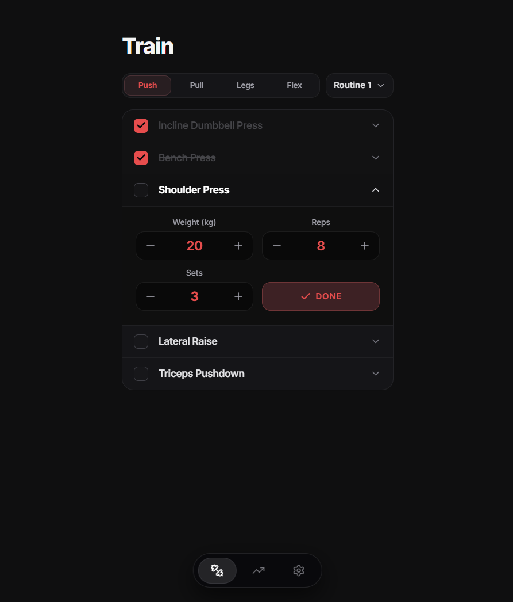

#  wrkout

Fast, distraction-free workout logger built for Push, Pull, Legs (PPL) splits. Log sets in seconds, track volume trends, and calculate progressive overload without ads or clutter.

[](https://wrkout-tracker.vercel.app/)
[](https://supabase.com)

---

## Preview

| Workout Dashboard & Logger |
| :---: |
|  |

---

## Features

- **Rapid Set Logging**: Log weight, reps, and completed sets in seconds with inline steppers and real-time state synchronization.
- **Volume & Overload Tracking**: Automatically calculate total tonnage and compare progression metrics against previous workout sessions.
- **PPL Routine Management**: Organize custom Push, Pull, and Legs workout routines with a pre-configured exercise library.
- **Frictionless Auth**: Username-based authentication mapped seamlessly to secure Supabase accounts with email recovery flows.
- **Tactile Feedback**: Integrated audio cues and Web Haptic API vibration triggers for immediate set completion confirmation.

---

## Tech Stack

- **Frontend**: Next.js 15 (App Router), React 18, TypeScript, Tailwind CSS, Framer Motion, Radix UI, Zustand, Immer
- **Backend**: Supabase (PostgreSQL, Auth, Migrations, Row-Level Security)
- **Deployment & Infra**: Vercel, Supabase Cloud / Docker (Local Supabase CLI)
- **AI Tooling**: Antigravity, Cursor

---

## Project Structure

```text
wrkout/
├── app/          # App Router pages, auth recovery routes, and global styles
├── components/   # UI components, workout builders, and dialog modals
├── hooks/        # React hooks for workout logic, audio feedback, and haptics
├── lib/          # Supabase client, Zustand stores, and shared utilities
├── public/       # Static assets, branding, audio cues, and PWA manifest
├── supabase/     # Database migrations, seed scripts, and local config
└── types/        # TypeScript global type definitions
```

---

## Getting Started

### Prerequisites

- Node.js 18+
- Docker Desktop (for local Supabase database)
- Git

### 1. Clone & Install

```bash
git clone https://github.com/ShreyanDev5/wrkout.git
cd wrkout
npm install
```

### 2. Environment Setup

Create a `.env.local` file in the root directory:

```env
NEXT_PUBLIC_SUPABASE_URL=http://localhost:54321
NEXT_PUBLIC_SUPABASE_ANON_KEY=your-local-anon-key
SUPABASE_SERVICE_ROLE_KEY=your-local-service-role-key

# Optional: Resend API key for password recovery emails
RESEND_API_KEY=
PASSWORD_RESET_FROM_EMAIL=
```

### 3. Start Database & Development Server

```bash
npx supabase start
npm run dev
```

Open [http://localhost:3000](http://localhost:3000) in your browser.

---

## Deployment

- **Hosted Application**: [wrkout-tracker.vercel.app](https://wrkout-tracker.vercel.app/)
- **Database & Backend Services**: [Supabase Cloud](https://supabase.com)

---

## Author

**Shreyan Sardar**
- **Portfolio**: [shreyandev.vercel.app](https://shreyandev.vercel.app)
- **GitHub**: [@ShreyanDev5](https://github.com/ShreyanDev5)
- **LinkedIn**: [shreyansardar](https://www.linkedin.com/in/shreyansardar/)
